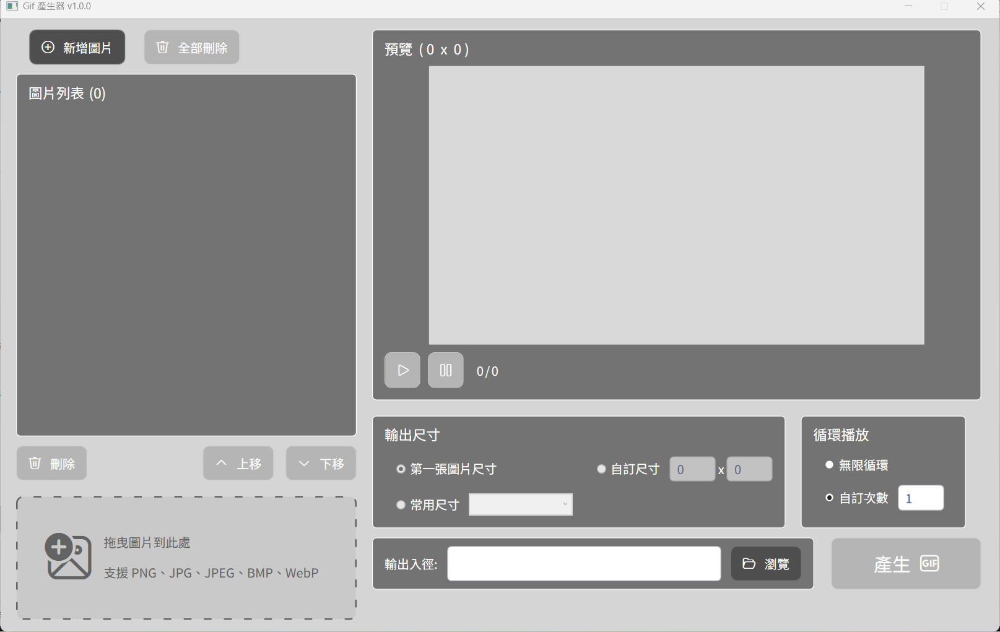

## 𖦹 Introduction
- 將多張圖片製作成 GIF，
- 圖片格式: png、jpg、jpeg、bmp、webp。
---

## Features
- 載入單張或多張圖片。
- 刪除單張或全部圖片。
- 上移或下移單張圖片。
- 從檔案總管將圖片拖進拖曳區塊。
- 預覽播放與暫停。
- 輸出尺寸、循環次數設定。
- 輸出檔案路徑。
- 產生 GIF。
---

## NuGet
- FluentIcons.Wpf
- CommunityToolkit.Mvvm
- Microsoft.Extensions.DependencyInjection
- gong-wpf-dragdrop
- Magick.NET-Q8-AnyCPU
---

## Versions
### 1.0.0
  - 首次 release。
---

## Optional
- 
---

## Requirements
- Windows 10/11
- .NET 10.0
- Visual Studio 2026
